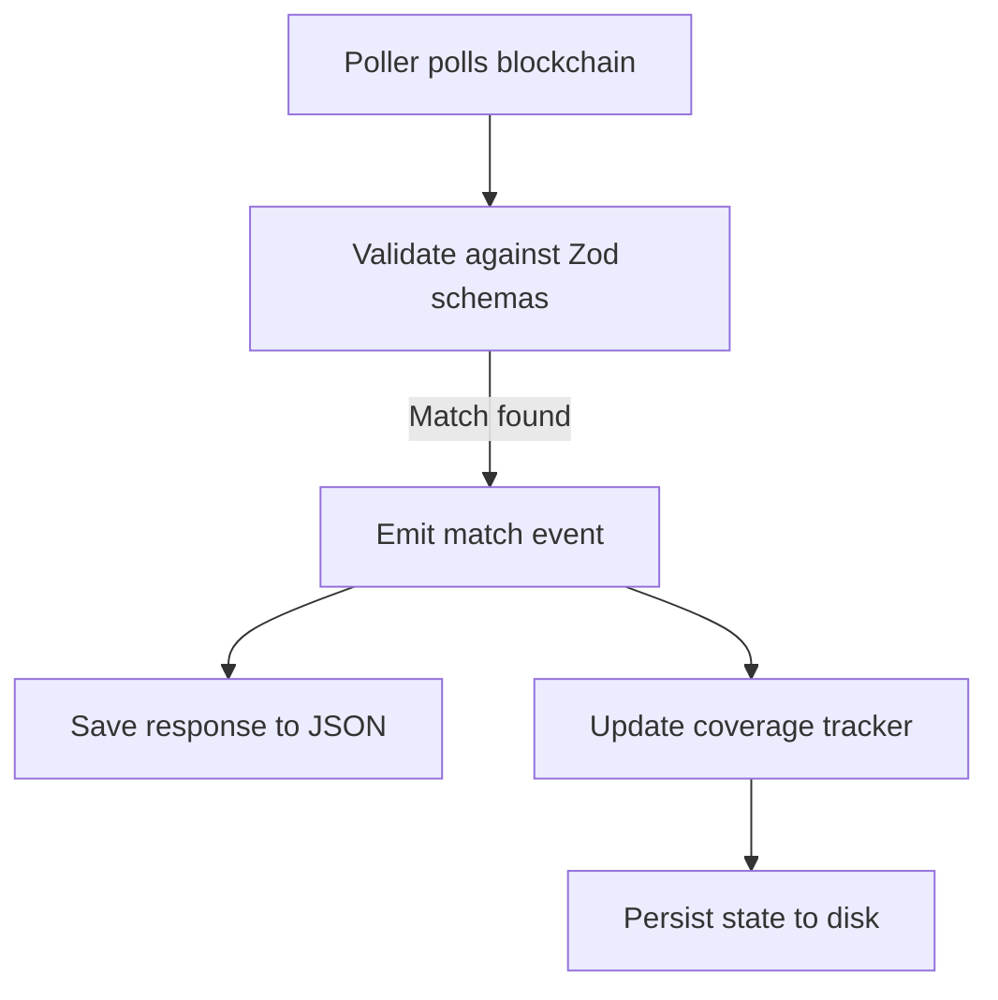

# AlgoKit Polytest Poller

A systematic data coverage collection tool for Algorand blockchain endpoints.

## Overview

The AlgorandPoller is an event-driven polling system that monitors algod endpoints, validates responses against Zod schemas, and collects real-world transaction patterns. Its primary goal is to systematically increase data coverage of Algorand API endpoints by capturing diverse transaction types and building test datasets.

## Purpose & Use Case

The poller enables:

- **Systematic Data Collection**: Monitor blockchain endpoints to capture real transaction patterns
- **Schema Validation**: Match API responses against comprehensive Zod schemas
- **Coverage Tracking**: Track which transaction types have been captured across polling sessions
- **Test Dataset Generation**: Build JSON datasets of validated responses
- **Incremental Collection**: Resume collection across multiple sessions with persistent state

## Getting Started

### Prerequisites

- Node.js 20+ and npm
- TypeScript knowledge recommended

### Installation

```bash
cd resources/poller
npm install
```

The postinstall script will automatically build the required algokit-utils dependencies. See [Dependencies & Setup](#dependencies--setup) for details about the custom fork.

### Quick Verification

Run tests to verify the installation:

```bash
npm test
```

Run an example to see the poller in action:

```bash
npx tsx examples/pending-transactions-schema-coverage.ts
```

### Next Steps

- Read [Quick Start](#quick-start) for basic usage examples
- Explore [examples/](examples/) directory for transaction-specific examples
- Review [API Reference](#api-reference) for detailed configuration options

## How It Works

### Architecture Overview

The poller is built on an event-driven architecture with:

- **Multiple concurrent pollers**: Run multiple independent polling instances
- **Two polling strategies**: Round-based (blockchain blocks) and interval-based (fixed time)
- **Zod schema validation**: Type-safe response validation
- **Coverage persistence**: State tracking across restarts
- **Graceful error handling**: Non-fatal errors allow continued polling

### Polling Strategies

#### 1. Round-Based Polling (Default)

Best for mainnet monitoring where blockchain progression is reliable.

```typescript
pollStrategy: {
  type: "round";
}
```

- Waits for blockchain blocks using `waitForBlock()` from algod
- Tracks round progression (start round → current round)
- Supports minimum poll interval to rate-limit requests
- Timeout based on rounds elapsed or time elapsed

#### 2. Interval-Based Polling

Best for testing scenarios or when block times are unpredictable.

```typescript
pollStrategy: { type: "interval", intervalMs: 2000 }
```

- Polls at specified millisecond intervals
- Independent of blockchain round progression
- Attempts to get current round for metadata (non-fatal if fails)
- Timeout based only on time elapsed

### Event System

The poller emits six event types for monitoring and data collection:

| Event            | Description                    | Use Case                                |
| ---------------- | ------------------------------ | --------------------------------------- |
| `poller:started` | Poller initialization complete | Log startup, record initial round       |
| `poller:poll`    | Every poll attempt             | Track progress, debug polling frequency |
| `poller:match`   | Schema validation succeeded    | Save matched response, update coverage  |
| `poller:error`   | Error occurred (non-fatal)     | Log errors, implement retry logic       |
| `poller:timeout` | Timeout reached                | Graceful shutdown notification          |
| `poller:stopped` | Poller stopped                 | Cleanup, final statistics               |

## Schema System

### Two-Tier Architecture

#### Tier 1: Transaction Validators (`schemas/transactions/`)

Reusable predicates that test individual `SignedTransaction` objects:

```typescript
// Basic type checks
isPaymentTransaction(txn);
isAssetTransferTransaction(txn);
isApplicationCallTransaction(txn);

// Parameterized validators
isPaymentToReceiver(address)(txn);
isPaymentWithMinAmount(amount)(txn);
isAssetTransferWithCloseOut(txn);

// Complex validators
isAppCallWithArgs(txn);
isAppCallWithLocalStateChange(txn);
```

**Available validators for all transaction types:**

- Payment (basic, with note, with close-out, to specific receiver, etc.)
- Asset Transfer (basic, with close-out, opt-in, etc.)
- Asset Config (create, reconfigure, destroy, etc.)
- Asset Freeze (freeze/unfreeze states)
- App Call (create, update, delete, opt-in, close-out, clear, no-op, with args, with state changes, etc.)
- Key Registration (online, offline, nonparticipation, etc.)

#### Tier 2: Endpoint Schemas (`schemas/algod/`)

Zod schemas that wrap endpoint responses with transaction validators:

```typescript
// Static schema
export const anyPendingTransactionsSchema =
  basePendingTransactionsSchema.refine(
    (data) => data.totalTransactions > 0,
    "No pending transactions found"
  );

// Parameterized schema
export function pendingPaymentToReceiverSchema(receiverAddress: string) {
  return basePendingTransactionsSchema.refine(
    (data) => data.topTransactions.some(isPaymentToReceiver(receiverAddress)),
    `No payment to ${receiverAddress} found in pending transactions`
  );
}

// Combination schema
export const pendingPaymentWithCloseOutSchema =
  basePendingTransactionsSchema.refine(
    (data) => data.topTransactions.some(isPaymentWithCloseOut),
    "No payment with close-out found in pending transactions"
  );
```

Multiple schemas are exported from [schemas/algod/get-pending-transactions.ts](schemas/algod/get-pending-transactions.ts), covering all transaction types and common combinations.

### Schema Matching

The `testMultipleSchemas()` utility (from `schemas/utils/schema-matcher.ts`) tests a response against multiple schemas and returns which ones matched:

```typescript
import { testMultipleSchemas } from "./schemas/utils/schema-matcher";

const schemas = {
  anyTransactions: anyPendingTransactionsSchema,
  paymentTxns: pendingPaymentTransactionsSchema,
  appCallTxns: pendingAppCallTransactionsSchema
};

const result = testMultipleSchemas(response, schemas);
// Returns: { matched: true, matchedSchemas: ["anyTransactions", "paymentTxns"], response }
```

This enables coverage tracking by identifying exactly which schemas matched each response.

## Coverage Tracking

### SchemaCoverageTracker

The coverage tracker (from `examples/pending-transactions-schema-coverage.ts`) provides:

- **Persistent state**: Saves matched schemas to JSON file
- **Incremental collection**: Resumes from previous state across restarts
- **Coverage calculation**: Percentage of schemas matched
- **Gap identification**: Lists unmatched schemas

```typescript
import { SchemaCoverageTracker } from "./examples/pending-transactions-schema-coverage";

// Initialize with all schema names
const tracker = new SchemaCoverageTracker(Object.keys(allSchemas));
tracker.setStatePath("./coverage-state.json");

// Load previous state (if exists)
await tracker.load();

// Mark schemas as matched
await tracker.markMatched(["schema1", "schema2"]); // Auto-saves if new matches

// Query coverage
tracker.getMatchedCount(); // 23
tracker.getTotalCount(); // 81
tracker.getCoveragePercent(); // "28.40%"
tracker.getUnmatchedSchemas(); // ["pendingAppCreation", ...]
tracker.isAllMatched(); // false

// Final save
await tracker.save();
```

### Data Collection Workflow



## Quick Start

### Basic Example

```typescript
import { AlgorandClient } from "@algorandfoundation/algokit-utils";
import { AlgorandPoller } from "./src/algorand-poller";
import { z } from "zod";
import {
  anyPendingTransactionsSchema,
  pendingPaymentTransactionsSchema
} from "./schemas/algod/get-pending-transactions";

// Connect to mainnet
const algorand = await AlgorandClient.mainnet();

// Create poller
const poller = new AlgorandPoller(algorand);

// Define schemas to match
const schemas = {
  anyTxns: anyPendingTransactionsSchema,
  payments: pendingPaymentTransactionsSchema
};

const unionSchema = z.union([schemas.anyTxns, schemas.payments]);

// Set up event handlers
poller.on("poller:match", async (event) => {
  console.log(`Match found at round ${event.round}`);
  // Save response to file or database
});

// Start polling
const pollerId = await poller.start({
  endpoint: () => algorand.client.algod.getPendingTransactions({ max: 1000 }),
  query: unionSchema,
  pollStrategy: { type: "interval", intervalMs: 2000 },
  timeout: { type: "time", value: 60000 } // 1 minute
});

// Wait for completion
await new Promise((resolve) => poller.on("poller:stopped", resolve));
```

### Examples Directory

The [examples/](examples/) directory contains working examples for each transaction type:

- Transaction-specific matchers: [payment-matching.ts](examples/payment-matching.ts), [app-call-matching.ts](examples/app-call-matching.ts), [asset-transfer-matching.ts](examples/asset-transfer-matching.ts), [asset-config-matching.ts](examples/asset-config-matching.ts), [asset-freeze-matching.ts](examples/asset-freeze-matching.ts), [key-registration-matching.ts](examples/key-registration-matching.ts)
- Comprehensive coverage tracker: [pending-transactions-schema-coverage.ts](examples/pending-transactions-schema-coverage.ts)

Each example demonstrates:

- Schema definition
- Event handler setup
- Response logging to JSON
- Coverage tracking (in schema-coverage example)

Run examples with:

```bash
npx tsx examples/pending-transactions-schema-coverage.ts
```

## API Reference

### AlgorandPoller Class

#### Constructor

```typescript
new AlgorandPoller(algorand: AlgorandClient, logger?: Logger)
```

#### Methods

##### `start(config: PollerConfig): Promise<string>`

Start a new poller instance. Returns a unique poller ID.

**Configuration:**

```typescript
interface PollerConfig<T> {
  endpoint: () => Promise<unknown>; // Function returning endpoint call
  query: z.ZodSchema<T>; // Zod schema for validation
  pollStrategy?: PollerPollStrategy; // Polling strategy (default: round-based)
  timeout?: PollerTimeout; // Timeout config (default: 1000 rounds)
  minPollInterval?: number; // Min delay between polls in ms (round-based only)
}

type PollerPollStrategy =
  | { type: "round" } // Wait for blockchain blocks
  | { type: "interval"; intervalMs: number }; // Poll at fixed intervals

type PollerTimeout =
  | { type: "rounds"; value: number } // Timeout after N rounds
  | { type: "time"; value: number } // Timeout after N milliseconds
  | { type: "none" }; // No timeout
```

##### `stop(pollerId: string): Promise<void>`

Stop a specific poller instance gracefully.

##### `stopAll(): Promise<void>`

Stop all running pollers gracefully.

##### `getStatus(pollerId: string): PollerStatus`

Get current status of a poller.

```typescript
interface PollerStatus {
  id: string;
  state: PollerState; // IDLE | RUNNING | STOPPED | ERROR
  pollCount: number;
  matchCount: number;
  errorCount: number;
  startRound?: bigint;
  currentRound?: bigint;
  startTime: Date;
  lastPollTime?: Date;
  nextPollTime?: Date; // Interval mode only
}
```

##### `isRunning(pollerId: string): boolean`

Check if a poller is currently running.

#### Event Handlers

##### `on(event: "poller:started", handler: (event: PollerStartedEvent) => void)`

```typescript
interface PollerStartedEvent {
  pollerId: string;
  startRound?: bigint;
  pollStrategy: PollerPollStrategy;
  timeout: PollerTimeout;
  minPollInterval?: number;
}
```

##### `on(event: "poller:poll", handler: (event: PollerPollEvent<T>) => void)`

```typescript
interface PollerPollEvent<T> {
  pollerId: string;
  round: bigint;
  pollCount: number;
  response: unknown;
  matched: boolean;
  validationResult: z.SafeParseReturnType<unknown, T>;
  timestamp: Date;
}
```

##### `on(event: "poller:match", handler: (event: PollerMatchEvent<T>) => void)`

```typescript
interface PollerMatchEvent<T> {
  pollerId: string;
  round: bigint;
  pollCount: number;
  response: T;
  timestamp: Date;
}
```

##### `on(event: "poller:error", handler: (event: PollerErrorEvent) => void)`

```typescript
interface PollerErrorEvent {
  pollerId: string;
  round?: bigint;
  pollCount: number;
  error: Error;
  errorCount: number;
  timestamp: Date;
}
```

##### `on(event: "poller:timeout", handler: (event: PollerTimeoutEvent) => void)`

```typescript
interface PollerTimeoutEvent {
  pollerId: string;
  round?: bigint;
  pollCount: number;
  timeout: PollerTimeout;
  timestamp: Date;
}
```

##### `on(event: "poller:stopped", handler: (event: PollerStoppedEvent) => void)`

```typescript
interface PollerStoppedEvent {
  pollerId: string;
  round?: bigint;
  pollCount: number;
  matchCount: number;
  errorCount: number;
  reason: "manual" | "timeout" | "error";
  timestamp: Date;
}
```

## Dependencies & Setup

### Custom AlgoKit Utils Fork

**IMPORTANT**: This package currently depends on a custom fork of `@algorandfoundation/algokit-utils`:

```json
{
  "dependencies": {
    "@algorandfoundation/algokit-utils": "github:mrcointreau/algokit-utils-ts#feat/export-packages-for-polytest-poller"
  }
}
```

#### Why This Fork is Needed

The custom fork adds package exports for internal modules required by the poller:

- `@algorandfoundation/algokit-utils/algod-client` - Response type definitions (e.g., `GetPendingTransactions`)
- `@algorandfoundation/algokit-utils/transact` - Transaction type definitions
- Core model metadata types for schema generation

These exports are not available in the standard algokit-utils package but are necessary for:

1. Type-safe schema definitions
2. Converting ModelMetadata to Zod schemas
3. Transaction type validation

**This dependency is temporary** and will be removed when the algokit-utils refactoring is completed and internal packages are officially exported.

### PostInstall Script

The package includes a `postinstall` script that builds `@algorandfoundation/algokit-utils` from source:

```json
{
  "scripts": {
    "postinstall": "node scripts/build-algokit-utils.mjs"
  }
}
```

#### Why This Script is Necessary

Due to a TypeScript/npm workspace issue with the algokit-utils monorepo structure:

- Running `npm run build` **inside** `node_modules/@algorandfoundation/algokit-utils` **does NOT** generate `.d.ts` files
- Running `npm run build` **outside** `node_modules` (in a temporary location) **correctly generates** `.d.ts` files

The build script (`scripts/build-algokit-utils.mjs`) works around this by:

1. Moving `node_modules/@algorandfoundation/algokit-utils` to a temporary folder (`.tmp-algokit-utils-build`)
2. Running `npm install --legacy-peer-deps` in the temporary folder
3. Running `npm run build` in the temporary folder
4. Copying the **contents** of the `dist/` folder back to `node_modules/@algorandfoundation/algokit-utils`
5. Cleaning up the temporary folder

This ensures TypeScript definitions are available for type checking and IDE support.

### Installation

```bash
cd resources/poller
npm install
```

The postinstall script will automatically run and build algokit-utils.

## Development

### Running Tests

```bash
npm test
```

Runs the Vitest test suite covering initialization, polling strategies, event emission, error handling, and timeouts.

### Running Examples

```bash
# Comprehensive coverage tracker
npx tsx examples/pending-transactions-schema-coverage.ts

# Payment transactions
npx tsx examples/payment-matching.ts

# App call transactions
npx tsx examples/app-call-matching.ts
```

### Type Checking

```bash
npm run check-types
```

### Linting

```bash
npm run lint
npm run lint:fix
```

### Project Structure

```
resources/poller/
├── src/
│   ├── algorand-poller.ts       # Main poller implementation
│   ├── poller-types.ts          # Type definitions
│   └── algorand-poller.spec.ts  # Test suite
├── schemas/
│   ├── algod/
│   │   ├── get-pending-transactions.ts  # Endpoint schemas
│   │   └── index.ts
│   ├── transactions/
│   │   ├── payment.ts           # Payment validators
│   │   ├── app-call.ts          # App call validators
│   │   ├── asset-transfer.ts    # Asset transfer validators
│   │   ├── asset-config.ts      # Asset config validators
│   │   ├── asset-freeze.ts      # Asset freeze validators
│   │   ├── key-registration.ts  # Key registration validators
│   │   ├── common.ts            # Common utilities
│   │   └── index.ts
│   ├── utils/
│   │   ├── schema-matcher.ts    # Multi-schema testing
│   │   └── zod-utils.ts         # ModelMetadata to Zod conversion
│   └── index.ts
├── examples/
│   ├── payment-matching.ts
│   ├── app-call-matching.ts
│   ├── asset-transfer-matching.ts
│   ├── asset-config-matching.ts
│   ├── asset-freeze-matching.ts
│   ├── key-registration-matching.ts
│   ├── pending-transactions-schema-coverage.ts
│   └── utils/
│       └── match-logger.ts
├── scripts/
│   └── build-algokit-utils.mjs
├── package.json
├── tsconfig.json
├── eslint.config.mjs
└── README.md
```
